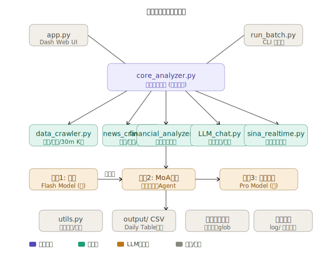

# 🤖 AI Trade Assistant

**AI Trade Assistant** 是一个基于大型语言模型（LLM）的自动化量化投研与决策支持系统，全面支持 A 股个股与 ETF 基金的深度解析。本项目将**经典高阶量化指标、资金流向、财务数据与大模型的深度逻辑推理能力**完美结合，并通过现代化的 Web UI 面板为交易者提供直观的决策参考。

经过最新的核心架构重构，本项目现已进化为标准且高度解耦的 **MVC (Model-View-Controller) 架构**。通过强大的统一分析引擎，系统完美实现了 **"漏斗式双模型过滤"** 与 **"多大师议事委员会 (MoA)"**，在保证极高质量研判的同时，兼顾了 API 调用成本与多流派视角的逻辑碰撞。

---

## ✨ 核心特性

* 🖥️ **全景可视化研判面板 (Web Dashboard)**：基于 Dash & Plotly 构建的交互式终端。内置高级交互式 K 线图，支持动态按键切换 MA/BOLL 主图指标，以及 MACD/KDJ/RSI 副图指标。一屏整合走势图、宏观大盘环境、核心指标、量化信号矩阵、最新新闻面以及 AI 深度逻辑推演。

* 🧠 **多大师议事与双筛架构 (MoA & Cost-Effective Routing)**：
  * **AI 裁判委员会 (MoA) 与动态角色扮演**：系统支持动态加载本地 Agent 人设（如巴菲特、利弗莫尔、威科夫等多位交易大师）。基础模型将并发扮演多位大师独立分析，最后由"投资总监（AI裁判）"进行交叉质证与拍板，严厉剔除数据幻觉，寻找非共识的正确。
  * **双模型漏斗**：支持"初筛+精决"过滤。使用低成本模型进行海量粗筛，仅触发关键信号或持有持仓时唤醒高级议事机制，**成本直降 80%+**。

* ⚙️ **极简且解耦的 MVC 工程架构**：UI 表现层 (`app.py`)、终端批处理层 (`run_batch.py`) 与核心逻辑引擎 (`core_analyzer.py`) 彻底分离。修改 Prompt 或新增数据源只需在引擎层调整一次，双端实时生效，严格遵循 DRY 原则。

* 📊 **硬核量化与基本面特征融合**：自动抓取并计算同花顺资金流向数据、52 周极值、PE/PB 历史分位，以及高阶统计套利指标。个股深度整合新浪财务数据与机构业绩预测。

* 🌍 **宏观风控与动态护城河**：自动拉取上证指数趋势与每日"宏观财经早餐"。让 Agent 具备全局视野，在系统性风险发生时自动规避盲目抄底。

* 💼 **智能持仓与动态目标追踪**：UI 集成持仓股数与成本录入。AI 决策严格结合您的实际仓位，并在面板中自动计算、高亮显示目标价与止损价相对于买入成本的**动态百分比收益率**。

* 🧠 **跨日历史记忆检索**：自动检索该标的近期历史决策记录，注入投资总监上下文，实现决策连贯性与反思纠错机制。

---

## 🗺️ 系统架构

下图展示了系统的核心模块与数据流向。两个入口（Web UI 与 CLI 批处理）共享同一个 `core_analyzer.py` 引擎，彻底避免逻辑重复。

```
┌─────────────────────────────────────────────────────────────────┐
│                         入口层 (Entry)                           │
│      app.py (Dash Web UI)          run_batch.py (CLI 批处理)     │
└───────────────────┬────────────────────────┬────────────────────┘
                    │                        │
                    └──────────┬─────────────┘
                               ▼
┌─────────────────────────────────────────────────────────────────┐
│               core_analyzer.py  ·  核心分析引擎                  │
└──┬──────────────┬──────────────┬──────────────┬─────────────────┘
   │              │              │              │
   ▼              ▼              ▼              ▼
data_crawler  news_crawler  financial_    LLM_chat.py
(行情/资金/    (新闻/宏观/    analyzer.py   (模型路由/
 30m K线)      快讯)         (财报解析)     调度)
                                               │
                               ┌───────────────┼───────────────┐
                               ▼               ▼               ▼
                           阶段1:初筛      阶段2:MoA       阶段3:裁决
                         Flash Model    多大师并发       Pro Model
                          (快速过滤)    Agent 议事       (拍板决策)
                               │
                               ▼
                    output/ CSV  ·  历史记忆  ·  新闻缓存
```

<details>
<summary>📐 查看完整架构图</summary>
  
<br>



</details>

---

## 🚀 快速开始

### 1. 环境准备与依赖安装 (推荐使用 Conda)

强烈推荐使用 **Miniforge** 或 **Anaconda** 来管理项目的 Python 环境，以避免繁杂的依赖冲突。建议创建一个名为 `agent` 的专属环境：

```bash
# 1. 创建并激活名为 agent 的环境 (推荐 Python 3.9+)
conda create -n agent python=3.12
conda activate agent

# 2. 安装核心依赖
pip install -r requirements.txt

# 3. 安装 Playwright 浏览器驱动 (新闻爬虫必须)
playwright install chromium
```

### 2. 模型与密钥配置 (.env)

本项目采用**动态解耦配置**，支持通过 OpenAI 兼容格式无缝接入任何本地开源模型（配合 LM Studio / Ollama）以及云端商业模型。

在项目根目录创建或修改 `.env` 文件。您可以随意配置您拥有的 API 资源，系统将自动在 Web 端和终端的选项中生成对应的模型下拉框。

**配置示例：**

```env
# ==========================================
# 模型注册表 (下划线分隔的唯一 ID)
# ==========================================
ACTIVE_MODELS="gemini_flash,gemini_pro,qwen_local"

# --- 1. Gemini Flash (推荐作为 Actor/初筛 与 MoA 角色扮演) ---
gemini_flash_TYPE="gemini"
gemini_flash_NAME="Gemini Flash"
gemini_flash_MODEL="gemini-2.0-flash-lite"
gemini_flash_API_KEY="你的_gemini_api_key"

# --- 2. Gemini Pro (推荐作为 Judge/裁判 与深度推演) ---
gemini_pro_TYPE="gemini"
gemini_pro_NAME="Gemini Pro"
gemini_pro_MODEL="gemini-2.5-pro-preview"
gemini_pro_API_KEY="你的_gemini_api_key"

# --- 3. 本地开源模型示例 (LM Studio / Ollama) ---
qwen_local_TYPE="openai"
qwen_local_NAME="Qwen-Local"
qwen_local_MODEL="qwen/qwen3-8b"
qwen_local_API_KEY="lm-studio"
qwen_local_BASE_URL="http://localhost:1234/v1"
qwen_local_STRIP_THINK="true"
```

> 💡 **提示**：`STRIP_THINK="true"` 用于自动过滤 DeepSeek-R1、Qwen3 等带 `<think>` 推理过程的模型输出，避免污染 JSON 解析。

### 3. 一键启动项目

确保在终端中激活了 `agent` 虚拟环境，您可以根据需求启动不同的分析模块：

```bash
conda activate agent

# 1. 启动 A股个股交互式面板 (主程序 Web UI)
#    启动后在浏览器访问 http://127.0.0.1:8050
python app.py

# 2. 启动批量分析终端 (适合盘后全市场扫盘)
#    拥有交互式命令行菜单，自动抽选或指定股票池，结果汇总至 Daily Table.csv
python run_batch.py

# 3. 启动 ETF 基金专属决策面板
#    自动抓取 ETF 份额与重仓明细，在浏览器访问 http://127.0.0.1:8051
python etf_app.py

# 4. 运行大模型竞技场 (并发测试多个模型的纯逻辑表现)
python model_arena.py
```

---

## 📁 项目结构

```
.
├── app.py                    # Web UI 主程序 (Dash)
├── run_batch.py              # CLI 批量扫盘脚本
├── portfolio.csv             # 持仓清单 (可选)
├── 主板股票代码.csv           # 全量 A 股代码池 (随机模式)
├── .env                      # 模型密钥配置 (不提交 Git)
├── LLM system content.txt    # 系统级 Prompt
├── requirements.txt
│
├── src/
│   ├── core_analyzer.py      # ⭐ 核心分析引擎 (统一入口)
│   ├── data_crawler.py       # 行情/资金/量化数据抓取
│   ├── financial_analyzer.py # 财报深度解析
│   ├── news_crawler.py       # 新闻/宏观/快讯爬虫
│   ├── sina_realtime.py      # 新浪实时行情接口
│   ├── LLM_chat.py           # LLM 多模型路由与调度
│   ├── utils.py              # 工具函数/图表生成/指标计算
│   ├── ui_components.py      # Dash UI 组件
│   └── agents_text/          # 投资大师 Agent 人设文件
│       ├── Charlie_Munger.txt
│       ├── Jesse_Livermore.txt
│       └── ...
│
├── output/                   # 分析结果输出 (按日期归档)
│   └── YYYY-MM-DD/
│       ├── Daily Table_YYYY-MM-DD.csv
│       └── {code}_{name}_output_*.txt
│
├── input/                    # LLM 输入日志 (按日期归档)
└── log/                      # 新闻与宏观缓存
    ├── stock_news/
    └── macro_news/
```

---

## 🗺️ 未来演进路线 (Roadmap)

| 状态 | 功能 |
|------|------|
| ✅ 已完成 | 交互式终端升级：从纯 CLI 升级为现代化 Dashboard，引入高级 K 线图表 |
| ✅ 已完成 | 架构解耦与重构：MVC 升级，剥离统一分析引擎，双端逻辑复用 |
| ✅ 已完成 | MoA 多大师议事：多模型并发分析、流派碰撞与 AI 裁判最终拍板 |
| ✅ 已完成 | ETF 市场覆盖：打通 F10 数据，实现指数与行业 ETF 的自动化投研 |
| ✅ 已完成 | 跨日历史记忆：检索历史决策注入上下文，实现决策连贯性 |
| ✅ 已完成 | **自动回测闭环**：读取历史决策日志，自动进行胜率与盈亏比归因分析 |
| 🔲 规划中 | **异步并发升级**：引入异步协程，将批量扫盘耗时压缩至分钟级 |
| 🔲 规划中 | **反思纠错机制**：Agent 在暴涨暴跌时自动对比历史判断进行逻辑反思 |

---

## ⚠️ 免责声明

本项目及代码仅供学习、技术研究与探讨 AI 在金融量化领域的应用。系统生成的任何输出（包括但不限于建议仓位、买入/卖出方向、目标价格等）**均不构成任何投资建议**。金融市场具有极高的风险，使用者需对自身账户的交易决策及盈亏负完全责任。